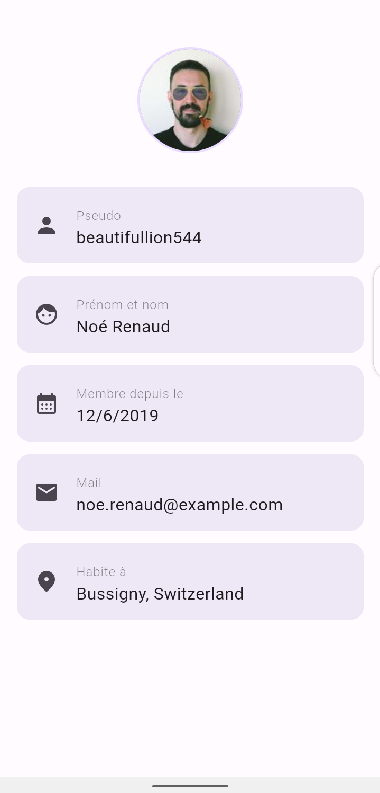
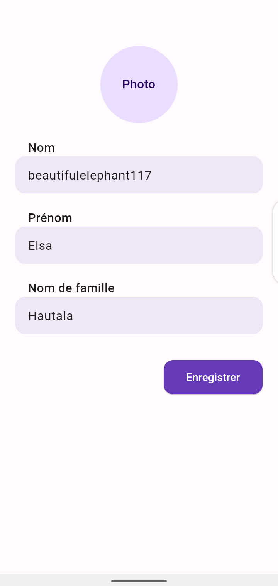
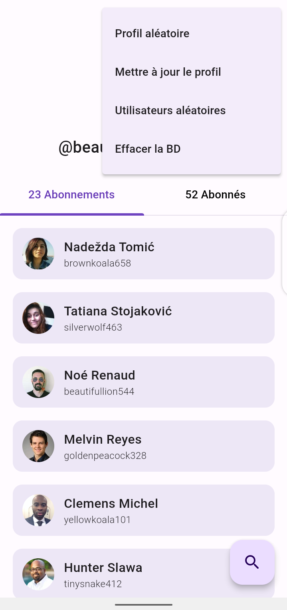

# RandomUser

### Description
RandomUser est une application simple qui utilise l'API randomuser.me pour générer une liste d'utilisateurs. L'utilisateur peut cliquer sur un utilisateur pour obtenir plus de détails à son sujet. Il peut également rechercher un utilisateur spécifique par son nom. Il peut également modifier son profil et enregistrer les changements.

### Installation
Pour lancer ce projet flutter, vous devez : 
- Installer flutter sur votre machine
- Cloner le projet
- Lancer la commande `flutter pub get` pour installer les dépendances
- Brancher votre téléphone à votre machine et activer le mode développeur ou
- Lancer un émulateur android ou ios sur votre machine
- Lancer la commande `flutter run` pour lancer le projet

Vous pouvez également installer directement l'apk sur votre téléphone en téléchargeant le fichier `app-release.apk` dans le dossier `release` du projet.

### Fonctionnalités
- Afficher une liste d'utilisateurs sous forme d'abonnés et d'abonnements
- Afficher les détails d'un utilisateur
- Rechercher un utilisateur par son nom, prenom ou pseudo
- Modifier le profil d'un utilisateur
- Enregistrer les changements
- Générer un profil aléatoire
- Générer une liste d'utilisateurs aléatoires

### Captures d'écran
- Acceuil (Liste des utilisateurs)

- Détails d'un utilisateur

- Recherche d'un utilisateur

- Modification de son profil

- Génération d'un profil aléatoire

### Temps de développement
- 2 jours (environ 16h)

### Remarques
Durant le développement de ce projet, je n'ai pas rencontré de difficultés majeures. Toutefois, j'ai eu quelques peines à formater correctement les données de l'API au format JSON vers un format adapté à une base de données SQL

J'ai utilisé la librairie `sqflite` pour la gestion de la base de données SQLite, ainsi que `shared_preferences` pour persister les données de l'utilisateur.

La librairie `http` a été choisie pour effectuer les requêtes HTTP vers l'API.

Le projet a été conçu en utilisant le pattern MVVM. J'ai utilisé la librairie `provider` pour la gestion des états de l'application.